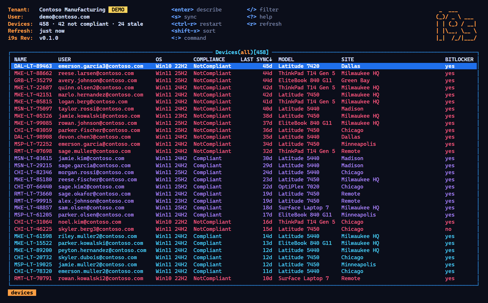
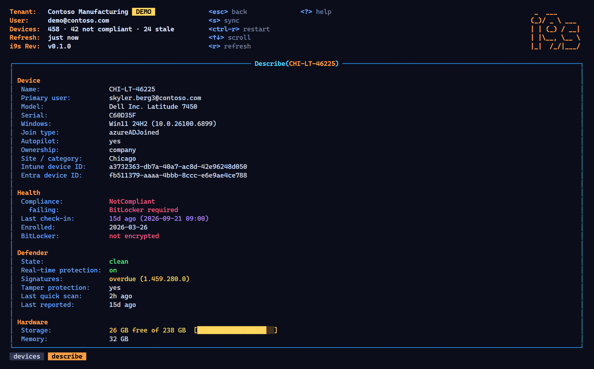
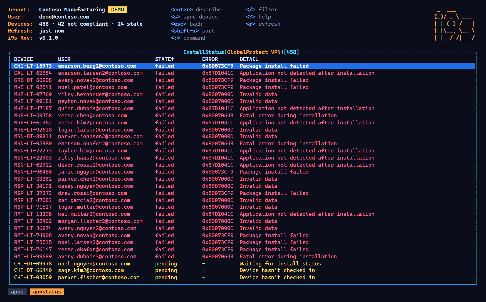
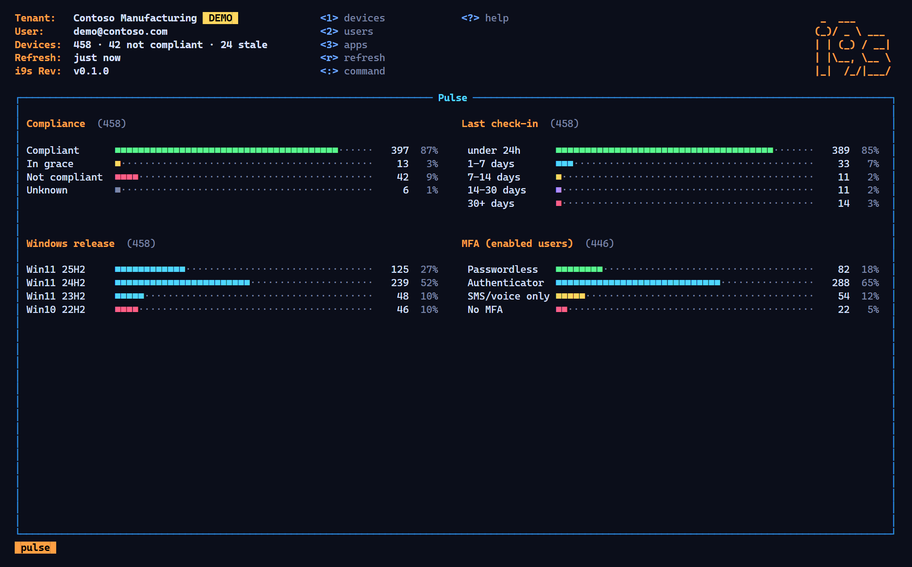
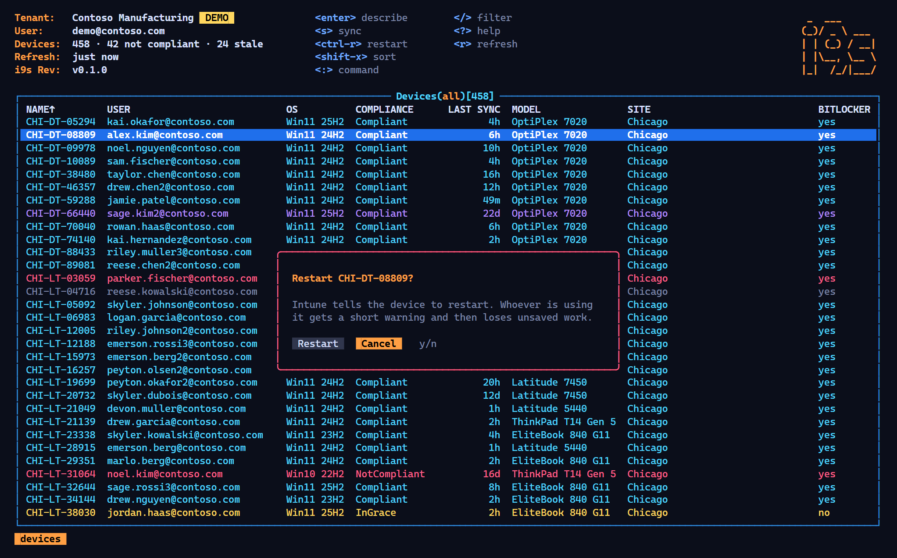

<div align="center">

<pre>
 _  ___
(_)/ _ \ ___
| | (_) / __|
| |\__, \__ \
|_|  /_/|___/
</pre>

**k9s for Microsoft Intune.** A fast, keyboard-driven terminal UI for your devices, people and apps.

[Install](#install) · [Try the demo](#try-it-without-a-tenant) · [Keys](#keys) · [How it signs in](#signing-in)



</div>

The Intune admin center is thorough and slow. i9s is the opposite: one screen, live data, and every question a keystroke away. Which devices haven't checked in? Press `L`. Why is that one red? Press `Enter`. Where is the VPN failing? `:apps`, pick it, and the failures are at the top.

## Install

Download the binary for your platform from [Releases](https://github.com/YeomanLabs/i9s/releases/latest) and put it on your `PATH`. It's a single file with nothing else to install.

Or, with Go:

```bash
go install github.com/YeomanLabs/i9s@latest
```

## Try it without a tenant

```bash
i9s --demo
```

This opens a fictional 458-device company with the same views, colors and keys. Sync and Restart are simulated.

## What you get

| Resource | Command | What it shows |
| --- | --- | --- |
| Devices | `:devices` `:dv` `1` | Every Windows device: user, Windows release, compliance, last check-in, model, site, BitLocker. Rows are colored: red not compliant, yellow in grace, purple silent 14+ days |
| Describe | `Enter` on a device | Health, failing compliance policies, Defender state and signatures, storage, join type, Autopilot, IDs |
| People | `:users` `:us` `2` | UPN, department, office, last sign-in, MFA strength (passwordless, authenticator, SMS only, none), licenses. `Enter` jumps to their devices |
| Apps | `:apps` `:ap` `3` | Assigned Windows apps. `Enter` shows install status on every device, failures first, with the Intune error code |
| Pulse | `:pulse` `:pu` `4` | A dashboard: compliance, check-in age, Windows releases, MFA coverage |

<table>
<tr>
<td width="50%"></td>
<td width="50%"></td>
</tr>
<tr>
<td width="50%"></td>
<td width="50%"></td>
</tr>
</table>

## Keys

| Key | Action |
| --- | --- |
| `:` | Command: `devices`, `users`, `apps`, `pulse`, `quit`. Add text to open filtered: `:dv dallas` |
| `/` | Filter the current list. Prefix `!` to exclude: `/!compliant` |
| `Shift`+letter | Sort by the column starting with that letter (press again to reverse) |
| `Enter` / `d` | Describe or drill in |
| `Esc` | Clear the filter, or go back |
| `s` | Sync the device (Intune remote action) |
| `Ctrl+R` | Restart the device, after you confirm |
| `r` | Refresh now (lists also refresh every 60 s) |
| `1`–`4` | Jump to devices, people, apps, pulse |
| `?` | Help |
| `q` / `Ctrl+C` | Quit |

## Signing in

```bash
i9s                       # opens a browser the first time
i9s users                 # start on a resource
i9s dv notcompliant       # start with a filter
i9s --sign-out
```

i9s signs in through **Microsoft Graph Command Line Tools**, Microsoft's own public client that already exists in every tenant (it's what `Connect-MgGraph` uses). There's no i9s app registration and no server: requests go from your terminal straight to Microsoft Graph. Tokens are cached encrypted by the OS (DPAPI on Windows, Keychain on macOS, the Secret Service on Linux), so you only sign in once.

An admin may need to approve the read-only permissions the first time. If your organisation prefers its own app registration, pass `--client-id` (and `--tenant`). It needs a public client with an `http://localhost` redirect URI.

**Permissions** (delegated):

| Permission | Used for |
| --- | --- |
| `DeviceManagementManagedDevices.Read.All` | Devices, Defender state |
| `DeviceManagementConfiguration.Read.All` | Compliance policy details |
| `DeviceManagementApps.Read.All` | Apps and install status |
| `User.Read.All`, `AuditLog.Read.All` | People, last sign-in, MFA registration |
| `DeviceManagementManagedDevices.PrivilegedOperations.All` | **Only if you use Sync or Restart.** Requested the first time you do |

i9s is read-only apart from Sync and Restart. There's deliberately no wipe, retire or delete.

## Building

```bash
go build -o i9s .
go test ./...
go run ./cmd/shots && node scripts/shots.mjs   # regenerate the README screenshots from the demo
```

Built with [Bubble Tea](https://github.com/charmbracelet/bubbletea) and [Lip Gloss](https://github.com/charmbracelet/lipgloss), and inspired by [k9s](https://k9scli.io). Push a `v*` tag to build releases for Windows, macOS and Linux.

## Related

[Fleet Galaxy](https://github.com/YeomanLabs/fleet-galaxy) shows the same tenant as a 3D galaxy, with a timeline.

## License

MIT © YeomanLabs
